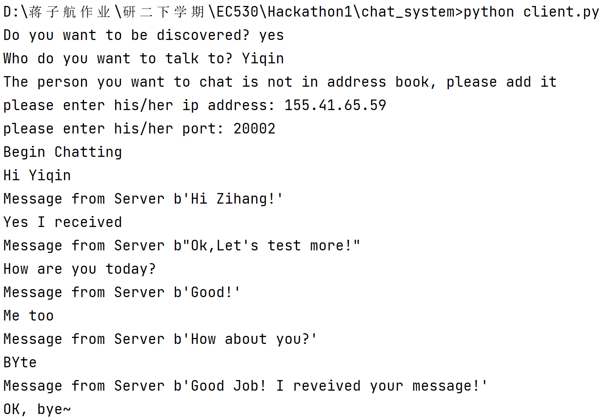

# EC530_Peer-to-Peer-Chat

This project implement a Peer-to-Peer command-line chat in python. 

Set up a P2P Chat server and allow multiple clients to connect to it using a client-side script. 
Clients use the socket port to communicate with the server socket. 

## MVP

#### Discovery

You register by making yourself findable by others (as in Whatsapp) 

#### Session 

InitiationSend a message to users who you want to connect with.

#### Communication and Synchronization

You can live connect with any of your friends who is available now.For users who are not available (offline), you can write messages, which are stored on your own client.The data for offline users will be synchronized when both users are discoverable.

#### Security

All is hashed

## User stories 

- I, the client, should be able to send messages to each other and edit them.
- I, the client, should be able to see contacts and choose one or many to chat with, 
- I, the client, should be able to block other users .
- I, the client, should be able to see the chat history. 
- I, the client, should be able to upload images or files to others.
- I, the client, should be able to read the transcription of the voice messages and should be able to search them.
- I, an AI developer, should be able to access the data anonymized.

## Achitect
- Peer to Peer Network support end-to-end communication.
- Local database to store data (e.g., SQLite).

## Results
Screenshot below shows chat from client's side. 

## Database Schema
Each client of peer-to-peer chat system has a local database belong to him uniquely. ***User*** table is like an address book, which stores his contacts and corresponding ip addresses. ***Receiver*** table stores all the messages received. ***Sender*** table stores all the messages he sent or want to send. Compared to ***Receiver*** table, ***Sender*** table has a unique column `status` with two values `pending` and `sent`. If the client doesn't want to be discovered, he can still send messages but all these messages will be stored with status `pending`. Next time when he wants to be discovered, all pending messages will be sent and then status `pending` will be change to `sent`.

### User table
| Field  | Type   |Null | Key | Default | Extra |
|------  |---------|-----| -----| -----|-----|
|name| varchar(40)   | YES | | NULL| |
|ip|  varchar(40)  | YES | |NULL | |
|port |   varchar(20)     | YES| | NULL| |

### Sender table
| Field  | Type   |Null | Key | Default | Extra |
|------  |---------|-----| -----| -----|-----|
|ip|  varchar(40)  | YES | |NULL | |
|port |   varchar(20)     | YES| | NULL| |
|name| varchar(40)   | YES | | NULL| |
|message| varchar(40)   | YES | | NULL| |
|status| varchar(40)   | YES | | NULL| |
|time| varchar(40)   | YES | | NULL| |

### Receiver table
| Field  | Type   |Null | Key | Default | Extra |
|------  |---------|-----| -----| -----|-----|
|ip|  varchar(40)  | YES | |NULL | |
|port |   varchar(20)     | YES| | NULL| |
|name| varchar(40)   | YES | | NULL| |
|message| varchar(40)   | YES | | NULL| |
|time| varchar(40)   | YES | | NULL| |

## To do
