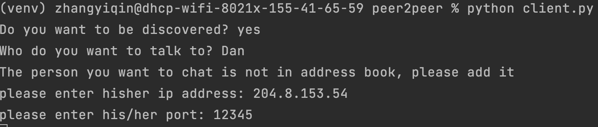
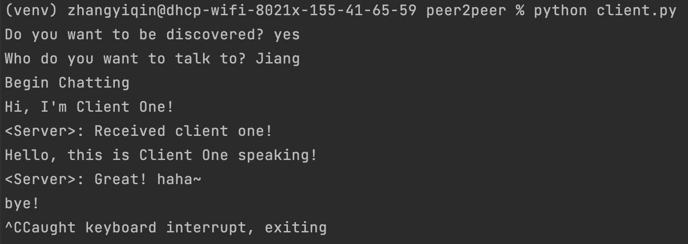
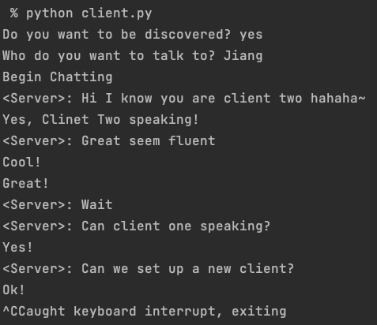
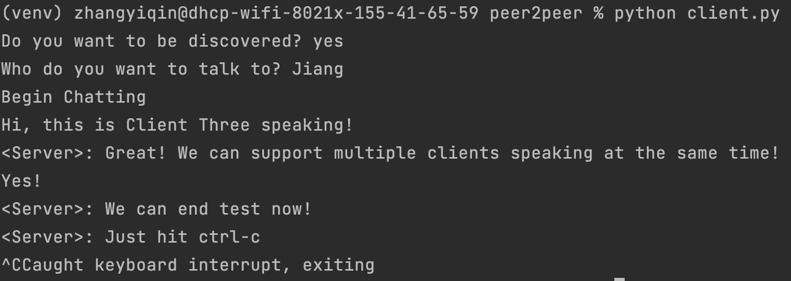

# EC530_Peer-to-Peer-Chat
This project implements a peer-to-peer chat application in python. 

P2P Chat allows multiple users chatting at the same time. There is no central server for this application. Each user has its own database and can serve as a individual server, which greatly improves robustness. 

Authors:   
jzh15@bu.edu  
evezhang@bu.edu  
If you have any question please feel free to contact them.

## Feature
- **Concurrency:** Users can chat with multiple persons concurrently. We use `selectors` module to monitor every socket connected.  
- **Discovery and Muteness:** Users can decide their state of discovery. When a user is discovered, clients can send them any updates or new chats. When a user is not discovered, the messages sent to him are pending, so users are able to block other users.  
- **Distributed Storage:** Data are distributed and securely stored on client's local databases.  
- **History:** Usesrs can display or search chat history from their local databases.  

## Usage
### Environment Setup
To use this peer-to-peer chat application, you have to install MySQL first and create a database `peer_to_peer_chat`. Then run the following command to create three tables we need.
```
$ python Database/build_tables.py
```
(Note: This application can't run on Windows. We use `selectors` module which can't monitor file objects on Windows. Other systems like Unix and Mac don't have such problem.)

### Server
If you want to be discovered and connected by others, you can run file `server.py` and become a server, which will set up a local server socket for you to receive connection from anyone who know your ip and port.  
```
$ python3 server.py
```

### Client
If you want to connect others, no matter you want to be discovered or not, you can run file `client.py` and become a client, it will give you options to be discovered or not. Below is an interface screenshot from client side.  
```
$ python3 client.py
```
  

If you want to be discovered, answer 'yes' to the first question, then enter the name of person you want to talk to. If the person's information is already stored in the local database, your client socket will connect that person's socket automatically and you can begin chatting. But if the person name you enter is a new name not stored, you will be asked to enter his ip address and corresponding port. After that your socket will build connection and you can begin chatting. If your socket can't build connection, which means, the person you choose don't want to be discovered, all the messages you send will be stored in your local database and marked 'pending'. Next time when you're online, all these pending messages will be sent together automatically.

If you don't want to be discovered, answer 'no' to the first question. You can still choose a person to talk to but all the messages you send will be stored in your local database and marked 'pending'. Next time when you want to be discovered, all these pending messages will be sent together automatically.


## Example Display
Here is an example we provide to show how the application works. We use two computers under different networks to do the test. In this example three chats happened at the same time.

The screenshot below shows the concurrent chat from the server's side. 


From image above you can find the server is talking to three clients at the same time. These three clients have the same ip address but different ports (because we only have two computers, one for server and one for clients). When you send messages from server side, one thing need noting is that you need to specify ip and port ahead, i.e. using format below  
```<ip> <port> <msg>```

The screenshot below shows the chat from client one.



The screenshot below shows the chat from client two.



The screenshot below shows the chat from client three. 




## Database Schema

Each client of peer-to-peer chat system has a local database belong to him uniquely. ***User*** table is like an address book, which stores his contacts and corresponding ip addresses. ***Receiver*** table stores all the messages received. ***Sender*** table stores all the messages he sent or want to send. Compared to ***Receiver*** table, ***Sender*** table has a unique column `status` with two values `pending` and `sent`. If the client doesn't want to be discovered, he can still send messages but all these messages will be stored with status `pending`. Next time when he wants to be discovered, all pending messages will be sent and then status `pending` will be change to `sent`.

### User table
| Field  | Type   |Null | Key | Default | Extra |
|------  |---------|-----| -----| -----|-----|
|name| varchar(40)   | YES | | NULL| |
|ip|  varchar(40)  | YES | |NULL | |
|port |   varchar(20)     | YES| | NULL| |

### Sender table
| Field  | Type   |Null | Key | Default | Extra |
|------  |---------|-----| -----| -----|-----|
|ip|  varchar(40)  | YES | |NULL | |
|port |   varchar(20)     | YES| | NULL| |
|name| varchar(40)   | YES | | NULL| |
|message| varchar(40)   | YES | | NULL| |
|status| varchar(40)   | YES | | NULL| |
|time| varchar(40)   | YES | | NULL| |

### Receiver table
| Field  | Type   |Null | Key | Default | Extra |
|------  |---------|-----| -----| -----|-----|
|ip|  varchar(40)  | YES | |NULL | |
|port |   varchar(20)     | YES| | NULL| |
|name| varchar(40)   | YES | | NULL| |
|message| varchar(40)   | YES | | NULL| |
|time| varchar(40)   | YES | | NULL| |

